# Predicting the price of diamonds using different Machine Learning approaches
---

## Main objective:
- Predict the price of diamonds based on their characteristics (features) using Machine Learning.
- To compare [LazyPredict](https://lazypredict.readthedocs.io/en/latest/), [H2O AutoML](https://docs.h2o.ai/h2o/latest-stable/h2o-docs/automl.html) and regular (*manual*) model training approaches, using the Root Mean Squared Error (RMSE) metric.
- To evaluate the presence of outliers in the dataset in the models' error.

---
## Preparing the data
- The dataset included 15 diamonds (out of 40455) whose x/y/z features (dimensions of the diamond) had a value of zero. They were removed.
- The features ``cut``, ``color`` and ``clarity`` were categorical. They were **encoded** according to their corresponding value in the market: higher numbers for more valuable features. The original dataset (before encoding) can be seen on the left, and the encoded features on the right.

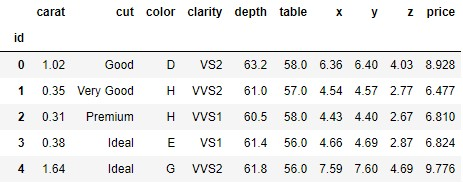 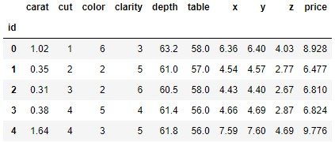

Each variable (feature) distribution and its influence to the price of the diamond were visualized in a pairplot. Here is a scatter plot showing each diamond feature against the price of that particular diamond:

- As it can be observed, some features seem to **contribute more** than others to the price of the diamonds, those are: ``carat``, ``x`` and ``y``.
- There are some **outliers** in some categories. I will try to remove them and see how they affect the overall error of the predicting models.

---

## 1- LazyPredict vs H2O AutoML
- LazyPredict and H2O AutoML **automatically** test and rank ML models based on your metric scoring value.
- Contrary to LazyPredict, H2O AutoML performs **hyperparameter** tuning and integrates cross-validation approaches.
- H2O AutoML is able to build **stacked ensemble** models and offers model **explainability methods** for an easy comparison and visualization.
- In addition, with H2O AutoML you can specify your **time-limit** requirement.

#### Example of **LazyPredict**'s output:

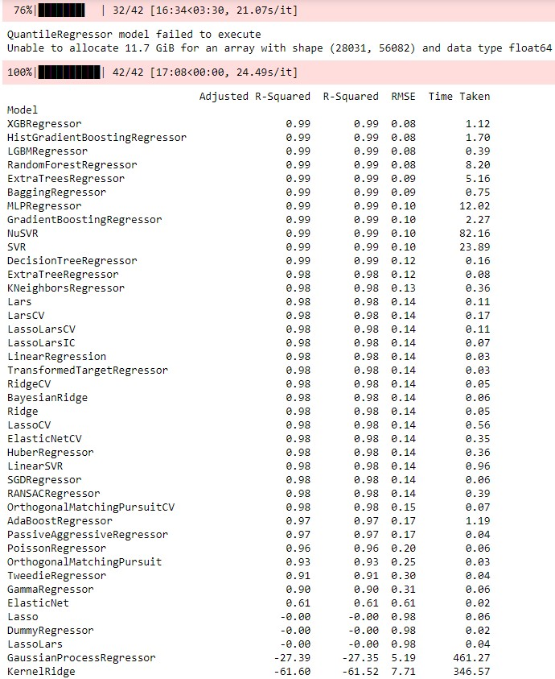

#### Example of **H2O AutoML**'s output:

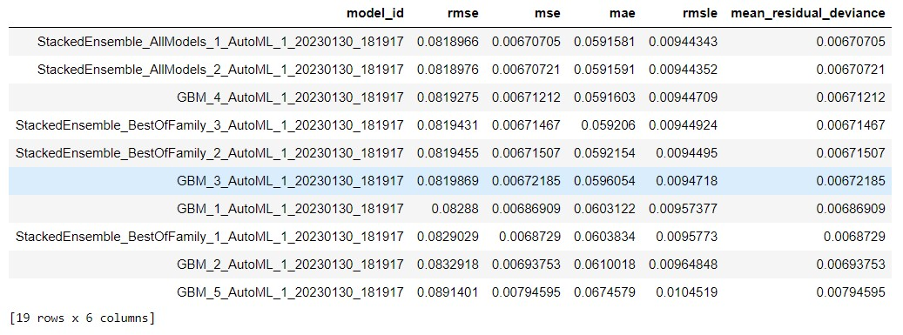

#### Comparing the top models obtained with the two methods:

The following plots show the best ranked models (based on lower RMSE value) obtained with each of the approaches. The cleaned datasets (with or without outliers) were split into training (80%) and test (20%), fit into the models, and the RMSE values were retrieved:

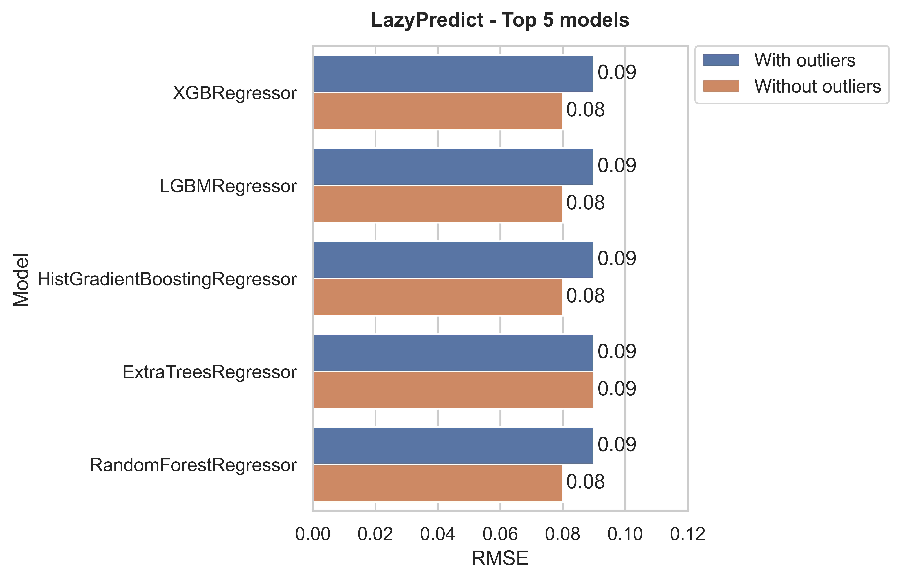 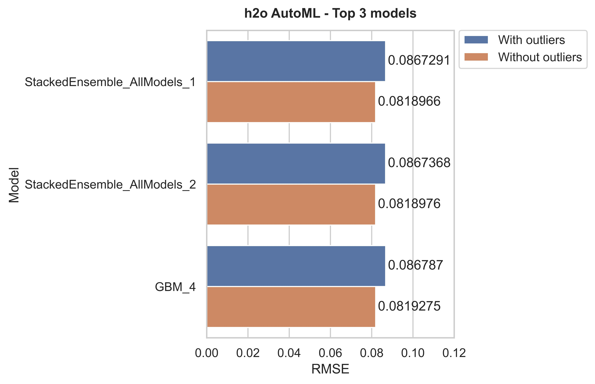

Overall, removing the outliers results in slightly better models (based on RMSE only). It's important to mention that the H2O AutoML models were built with a ``max_runtime_secs = 60``. In addition, we can access the base models used to built the StackedEnsemble using `model.params['base_models']`. We can save StackedEnsemble model and retrieve its base models and parameters for a later retraining on new data.

---

## 2- Model explainability of AutoML

The model explainability methods included in H2O AutoML offer a great way of easily **comparing** and visualizing the leaderboard models, as well as to identify those variables (features) that **contribute** the most to the target variable.

#### Model correlation
> This plot shows the correlation between the predictions of the models. By default, models are ordered by their similarity (as computed by hierarchical clustering).

Overall, all models behave similarly (except GBM_grid_1_model_4), so we shouldn't see much difference.

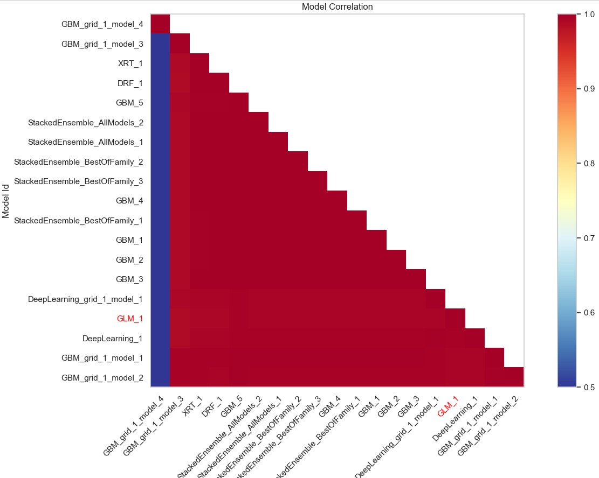

#### Variable importance heatmap
> Variable importance heatmap shows variable importance across multiple models.

As it can be observed, the `carat` feature contributes the most to the models. And now we see how different the model GBM_grid_1_model_4 is from the rest. 

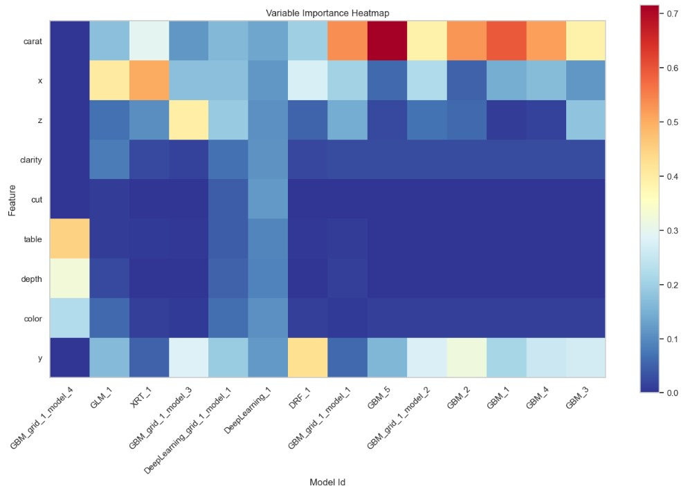

#### SHAP summary for model GBM_4
> SHAP summary plot shows the contribution of the features for each instance (row of data). The sum of the feature contributions and the bias term is equal to the raw prediction of the model.

The variables ``carat``, ``x`` and ``y`` contribute the most to each particular diamond's price.

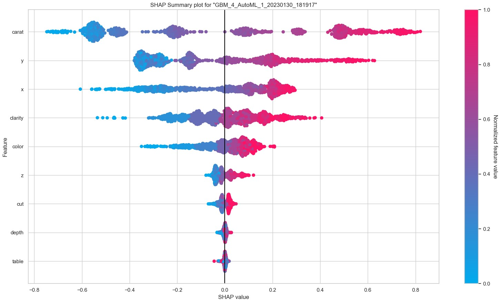

#### Variable importance for model GBM_4
> The variable importance plot shows the relative importance of the most important variables in the model.

As observed in the first scatter plot and depicted aswell by the SHAP summary plot, the variables ``carat``, ``x`` and ``y`` are the most important, thus they influence the most the price of diamonds.

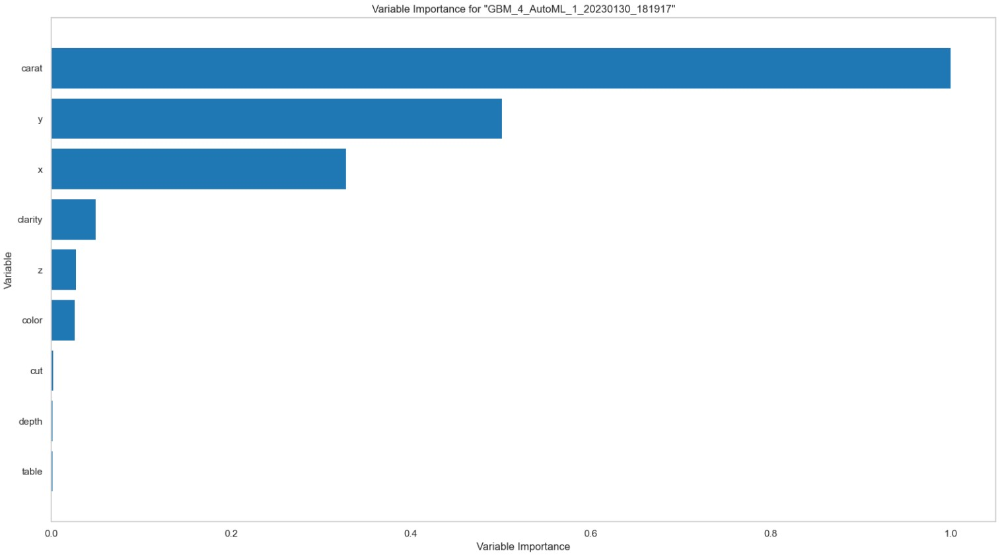

---

## 3- *Manual* training of models

- Three models were *manually* trained: GradientBoostingRegressor, RandomForestRegressor and XGBRegressor, as they were within the top 3 ranked models in both LazyPredict and H2O AutoML.
- XGBoost was used for **feature selection** using Recursive Feature Elimination (RFE) from sklearn (which variables contribute most to the price of diamonds; to compare it with AutoML's variable importance) and for **hyperparameter tuning** using GridSearchCV.

#### Feature selection

As depicted by AutoML, the variables ``table``, ``depth``, ``cut``, ``color`` and ``z`` contribute the less to diamonds' pricing:

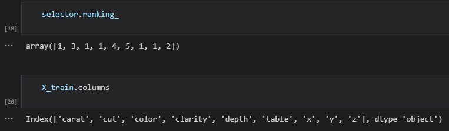

#### Comparison of the models:

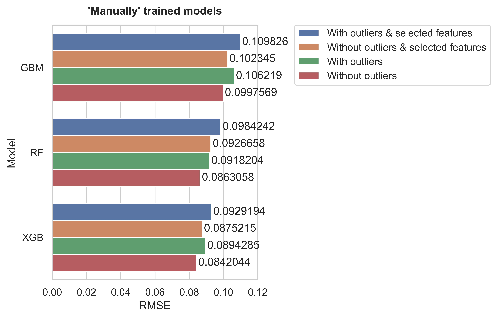

---

# Conclusions
XGBoost outperforms the other two tree-based models, as depicted before by LazyPredict. However, AutoML automatically retrieved **parameter-tuned stacked ensemble and GBM methods** that, with the inputed dataset, are able to better predict the price of diamonds (based on RMSE).

